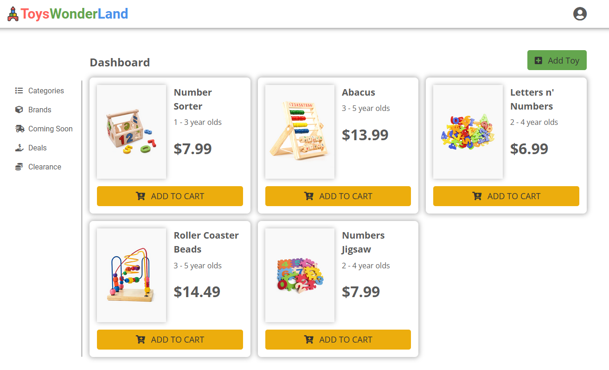

# DMIT2008 - Assignment 01 - ToysWonderLand Online Toy Store

| Author          | Version | Last Modified On |
| --------------- | ------- | ---------------- |
| Deepak Joy Jose | 1.0.0   | 12/Feb/2022      |

ToysWonderLand is an online toystore which is built using **HTML**, **CSS/Sass** and **JavaScript** and uses **firebase** to store its data.

## How to use ToysWonderLand

### 📖 Read from firebase

You can find all toys in our store by visiting the home page of [ToysWonderLand](https://toyswonderland.netlify.app/). This data is read from firebase realtime database and cloud storage.

<figure>
  
  <figcaption>ToysWonderLand Dashboard</figcaption>
</figure>

### ➕ Add Toy

1. To add a new toy, click on the `Add Toy` button in the dashboard.
2. Once you are in the `Add Toy` page, enter the `Toy Name`, `Age Group` & `Price` and then add the toy image by clicking on `Select Image`.
3. Click on the `Add Toy` button.
4. Go back to the Dashboard to view the newly added toy.

<figure>
  
  <figcaption>Add Toy Page</figcaption>
</figure>

### 📝 Edit Toy

1. To `edit` a toy, hover your mouse over the card for that toy, then click on the `edit` button you will see on the _top left corner_ of the card. You will now be taken to the `Edit Toy` page.
   
2. Once you reach the edit page, update the fields that you need to update in the form, then click on the `Save Changes` button.
3. Go back to the Dashboard to view the updated toy information.

### ❌ Delete Toy

1. To `delete` a toy, hover your mouse over the card for that toy, then click on the `delete` button you will see on the _top left corner_ of the card. You will now see a `Confirm Delete` dialog open.
   
2. Confirm that you want to proceed with the deletion by clicking on the `Confirm` button.
   
